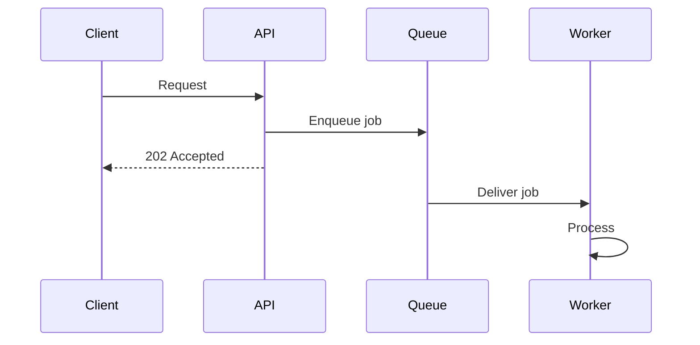

# [Design Title]

<!-- Short, descriptive title. Examples: "Event Processing Pipeline v2", "Notification Delivery Flow" -->

## Context

[The problem being solved and the constraints. What prompted this design work. Include enough background that a reader unfamiliar with the initiative can understand why the design was needed. Cover technical, organizational, and timeline constraints.]

## Design Overview

[The high-level architecture. Describe the major components, data flow, API contracts, and schema changes.]

[Use a Mermaid diagram where it helps. Example:]

<!--
If the design spans multiple subsystems, summarize each in 2-3 sentences here
and link to its subdesign doc. Do not inline subdesign content.

- **Subsystem A** — [One-line purpose.] See [subdesigns/subsystem-a.md](subdesigns/subsystem-a.md).
- **Subsystem B** — [One-line purpose.] See [subdesigns/subsystem-b.md](subdesigns/subsystem-b.md).
-->

## Alternatives Considered

### [Chosen approach] (chosen)

**Gains:**
- [What this approach provides]

**Gives up:**
- [What this approach costs]

### [Alternative 1]

**Gains:**
- [What this alternative would have provided]

**Gives up:**
- [What this alternative would have cost]

**Why rejected:** [Specific reason this alternative was not chosen]

### [Alternative 2]

**Gains:**
- [What this alternative would have provided]

**Gives up:**
- [What this alternative would have cost]

**Why rejected:** [Specific reason this alternative was not chosen]

## Dependencies & Risks

**External dependencies:**
- [Vendors, services, or infrastructure this design depends on]

**Migration concerns:**
- [How existing data, traffic, or state moves to the new design]

**Rollback strategy:**
- [What we do if this doesn't work in production]

**Risks:**
- **Risk:** [Specific scenario that could go wrong]. **Mitigation:** [How we detect or prevent it].
- **Risk:** [Specific scenario]. **Mitigation:** [Plan].

## Acceptance Criteria

- [Observable, verifiable criterion 1 — e.g., "p99 latency for endpoint X drops below 500ms"]
- [Observable, verifiable criterion 2]
- [Observable, verifiable criterion 3]

<!--
## ADR Candidates

Uncomment this section if the design surfaced architectural decisions that warrant their own ADR.
Each entry: one-line summary, then trigger criteria.
Draft each separately via the `draft-adr` skill — do not include the ADR body here.

- **[Decision summary].** Trigger: [which criteria from when-to-write-design-doc.md were matched].
- **[Decision summary].** Trigger: [criteria].
-->
