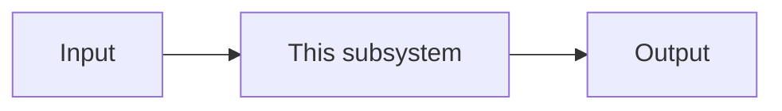

# [Subsystem Name]

<!--
Subdesign doc for a single subsystem within a larger design.
The parent DESIGN.md must link to this file from its Design Overview section.
Scope: a single bounded context or component within the parent design.
-->

## Context

[The scope of this subsystem and its role within the larger design. Link back to the parent DESIGN.md and cite the specific slice this subdesign covers.]

## Design Overview

[The architecture for this subsystem. Describe its components, data flow, and contracts. Use diagrams where they help.]

## Alternatives Considered

<!--
Include this section if the subsystem has alternatives distinct from those captured in the parent DESIGN.md.
Omit if all relevant alternatives are covered at the parent level.
-->

### [Chosen approach] (chosen)

**Gains:**
- [What this approach provides]

**Gives up:**
- [What this approach costs]

### [Alternative]

**Gains:**
- [What this alternative would have provided]

**Gives up:**
- [What this alternative would have cost]

**Why rejected:** [Specific reason this alternative was not chosen]

## Dependencies & Risks

**Dependencies:**
- [External or cross-subsystem dependencies specific to this component]

**Risks:**
- **Risk:** [Scenario]. **Mitigation:** [Plan].

## Acceptance Criteria

- [Observable criterion specific to this subsystem]
- [Observable criterion specific to this subsystem]
