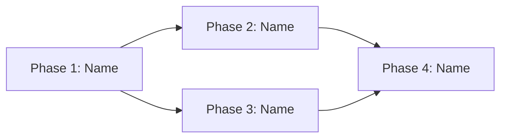

# [Plan Name]

## Goal

[What we're trying to accomplish and why. 2-5 sentences that any team member can read and understand the motivation.]

## Phase Diagram

<!-- Optional: Include when phases have complex dependencies or parallel paths.
     Remove this section if phases are purely sequential. -->

## Phases

### Phase 1: [Phase Name]

[One-line description of what this phase accomplishes.]

**Dependencies:** None (first phase)

[For complex phases, add: See `phases/01-phase-name.md` for detailed breakdown.]

### Phase 2: [Phase Name]

[One-line description.]

**Dependencies:** Phase 1

### Phase 3: [Phase Name]

[One-line description.]

**Dependencies:** Phase 2

## Decision Log

| Date | Decision | Rationale |
|------|----------|-----------|
| [YYYY-MM-DD] | Initial plan created | [Brief context] |

## ADR Candidates

<!-- Optional: Include when architectural decisions were identified during planning.
     Remove this section if no ADR candidates were found. -->

| ADR | Summary | Trigger |
|-----|---------|---------|
| [NNNN-short-name] | [One-line description of the decision] | [Which trigger criteria it matched] |

## Open Questions

- [Question 1 — context on why it matters]
- [Question 2 — context on why it matters]